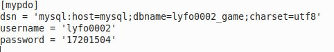
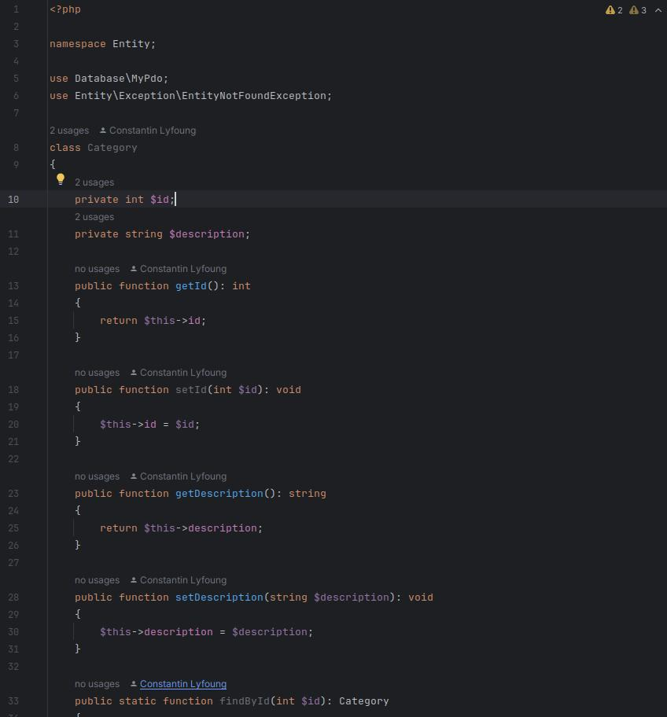
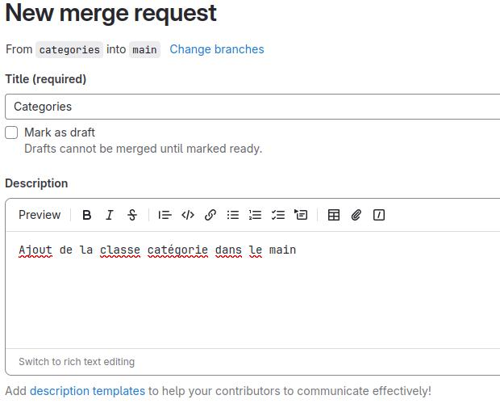
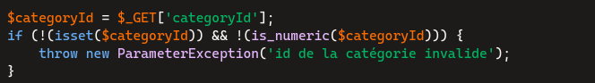
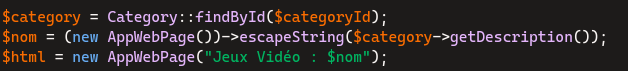
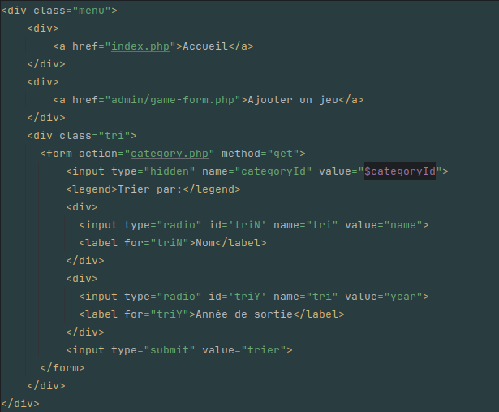
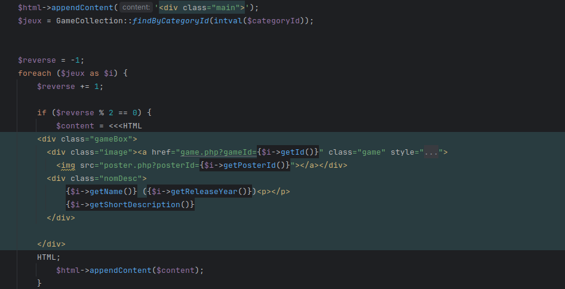
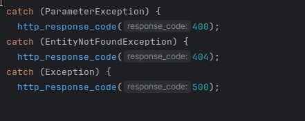

# SAE2-01 : Développement d’une application
## Auteurs : 
- Lyfoung Constantin (```lyfo0002```)
- Betry Eliott (```betr0003```)
## Mise en place du projet
- Initialisation de ```composer```
    > ```composer init```
- Ajout de ```php-cs-fixer```
    > ```composer require friendsofphp/php-cs-fixer --dev```
- Récupération de la base de données
    > 
- création de ```.mypdo.ini```
    > 
## Création des classes
### Création de la classe ```Category```
- Création de la branche categories
    > ```git branch categories```
> 
- Création de la merge request sur Gitlab
> 

### Création des classe ```Genre,Game,Poster,	CategorieCollection,genreCollection,GameCollection```
``
 - Même procédé pour les classes mais utilisation de ```git rebase```
    > branche genre active :
    >```git checkout genre```
    >
    > rebase la branche sur main:
    >```git rebase main```
    
    
## Ajout des methodes

### Methode pour la classe catégorie

#### Récupération de l'ID de catégorie



- Récupère l'ID de la catégorie via la requête GET.

- Vérifie si l'ID existe et est bien un nombre.

- Lance une exception si l'ID est invalide (ParameterException).


#### Récupération de la catégorie



- Utilise Category::findById($categoryId) pour chercher la catégorie en base de données.

- Nettoie la description avec escapeString() pour éviter les injections XSS.

- Initialise une page web avec new AppWebPage("Jeux Vidéo : $nom").


#### Création du menu



Ajoute un menu contenant :

- Un lien vers l'accueil.

- Un lien pour ajouter un jeu.

- Un formulaire de tri permettant de classer les jeux par nom ou année de sortie.


#### Affichage des jeux



- Récupère la liste des jeux via GameCollection::findByCategoryId().

- Alterne l'affichage (gameBox et gameBox_rev) pour un effet visuel dynamique.

- Ajoute chaque jeu avec son nom, année de sortie et description courte.


#### Gestion des erreurs



Gère les erreurs courantes :

- 400 Bad Request → ID invalide.

- 404 Not Found → Catégorie ou jeu introuvable.

- 500 Internal Server Error → Erreur inattendue.


### Methode pour la classe game

#### Récupération et Validation de l'ID du Jeu

