# SAE2-01 : Développement d’une application
## Auteurs : 
- Lyfoung Constantin (```lyfo0002```)
- Betry Eliott (```betr0003```)
## Mise en place du projet
- Initialisation de ```composer```
    > ```composer init```
- Ajout de ```php-cs-fixer```
    > ```composer require friendsofphp/php-cs-fixer --dev```
- Récupération de la base de données
    > 
- création de ```.mypdo.ini```
    > 
## Création des classes
### Création de la classe ```Category```
- Création de la branche categories
    > ```git branch categories```
> 
- Création de la merge request sur Gitlab
> 

### Création des classe ```Genre,Game,Poster,CategorieCollection,genreCollection,GameCollection```
``
 - Même procédé pour les classes mais utilisation de ```git rebase```
    > branche 'nom de la classe' active :
    >```git checkout 'nom de la classe'```
    >
    > rebase la branche sur main:
    >```git rebase main```
    
    
## Ajout des methodes

### Methodes pour les classse category,genre,poster,developer,game

Ajout des getters et setters + findbyid

static findById(int $id): Category
- Recherche une catégorie dans la base de données à partir de son identifiant :

- Prépare et exécute une requête SQL sécurisée.
Retourne un objet Category si trouvé.
Lève une exception EntityNotFoundException si aucune catégorie ne correspond à l’ID fourni.

### Methodes en plus pour la classe game

findGenres(): array
- Retourne la liste des genres associés à un jeu donné.

findCategory(): array
- Retourne la liste des catégories associées à un jeu donné.

delete(): Game
- Supprime le jeu de la base de données et met son identifiant à null.

update(): Game
- Met à jour les informations du jeu dans la base de données avec les valeurs actuelles de l’objet.

static create(...) : Game
- Crée une instance de Game avec les paramètres fournis, sans l’insérer en base de données.

insert(): Game
- Insère le jeu dans la base de données avec les propriétés actuelles de l’objet.

save(): Game
- Insère ou met à jour le jeu dans la base de données selon que son identifiant est null ou non.

### Methodes pour les classes genreCollection et CategoryCollection

static findAll(): Category[]

- Récupère toutes les catégories depuis la table category.
- Retourne un tableau d’objets Category.
- Trie les résultats par ordre alphabétique (ORDER BY description).

### Methodes pour la classe GameCollection

static findByCategoryId(int $categoryId): Game[]
- Récupère tous les jeux associés à une catégorie donnée (categoryId).
Le tri peut être :
- Par année de sortie, puis nom (?tri=year)
- Par nom, puis année (par défaut)

Retourne un tableau d’objets Game.

static findByGenreId(int $genreId): Game[]
- Récupère tous les jeux associés à un genre donné (genreId).
Le tri peut être :
- Par année de sortie, puis nom (?tri=year)
- Par nom, puis année (par défaut)

Retourne un tableau d’objets Game.

### Methode pour l'HTML
#### Classe AppWebPage

La classe AppWebPage étend la classe WebPage pour fournir une structure HTML complète avec un en-tête, un pied de page, et une feuille de style CSS intégrée.

__construct(string $title = "")
- Initialise la page avec un titre.
- Ajoute automatiquement la feuille de style /css/style.css.

toHtml(): string
- Génère le HTML complet de la page.

Structure :
- Balises HTML5 (<!doctype html>, <html>, <head>, <body>)
- Titre de la page
- Inclusion des métadonnées et du CSS
- En-tête avec le titre
- Corps de la page (contenu dynamique)
- Pied de page affichant la date et l’heure de la dernière modification du fichier PHP courant

#### Classe WebPage

__construct(string $title = '')
- Initialise une nouvelle page avec un titre facultatif.

appendContent(string $content): void
- Ajoute du contenu HTML au corps de la page.

appendCss(string $css): void
- Ajoute du CSS directement dans une balise style dans l’en-tête.

appendCssUrl(string $url): void
- Ajoute une feuille de style externe via une balise link.

appendJs(string $js): void
- Ajoute du JavaScript directement dans une balise script dans l’en-tête.

appendJsUrl(string $url): void
- Ajoute un fichier JavaScript externe via une balise script src="..."

appendToHead(string $content): void
- Ajoute du contenu brut à l’en-tête HTML.

escapeString(string $string): string
- Échappe une chaîne de caractères pour l’affichage HTML sécurisé (via le trait StringEscaper).

getHead(): string / setHead(string $head): void
- Accède ou modifie le contenu de l’en-tête HTML.

getTitle(): string / setTitle(string $title): void
- Accède ou modifie le titre de la page.

getBody(): string / setBody(string $body): void
- Accède ou modifie le contenu du corps de la page.

toHTML(): string
- Génère le HTML complet de la page, incluant le <!doctype>, les balises <html>, <head>, et <body>.

getLastModification()
- Retourne la date de dernière modification du fichier PHP courant (via getlastmod()).

#### Classe GameForm

__construct(?Game $game = null)
- Initialise le formulaire avec un jeu existant (pour modification) ou vide (pour création).

getGame(): ?Game
- Retourne l’objet Game associé au formulaire.

getHtmlForm(string $url): string
Génère le code HTML du formulaire :

- Pré-remplit les champs si un jeu est fourni.
- Envoie les données via POST à l’URL spécifiée.
- Inclut les champs : nom, année de sortie, description, prix, systèmes d’exploitation, note Metacritic, ID développeur.

setEntityFromQueryString(): void
- Construit une instance de Game à partir des données $_POST.
- Valide chaque champ et lève une ParameterException si un champ obligatoire est manquant ou invalide.
- Utilise la méthode Game::create(...) pour créer l’objet.

#### Récupération de l'ID de category


- Récupère l'ID de la catégorie via la requête GET.

- Vérifie si l'ID existe et est bien un nombre.

- Lance une exception si l'ID est invalide (ParameterException).

## Public

### Admin

#### game-delete

1) Récupération de l’ID

2) Validation de l’ID :

- Vérifie que l’ID est bien défini et numérique.
- Sinon, lève une ParameterException.

3) Suppression du jeu :

- Utilise Game::findById($id) pour récupérer le jeu.
- Appelle $game->delete() pour le supprimer de la base de données.

4) Redirection :

- Redirige vers la page d’accueil (/index.php) après suppression.

5) Gestion des erreurs :

- 400 Bad Request si l’ID est invalide.
- 404 Not Found si le jeu n’existe pas ou une autre erreur survient

#### game-form

1) Vérification de l’ID dans l’URL :

- Si un id est présent et valide (?id=...), le jeu correspondant est récupéré via Game::findById(...).
- Sinon, un formulaire vide est généré pour la création d’un nouveau jeu.

2) Génération du formulaire :

- Le formulaire est généré via $form->getHtmlForm('game-save.php').
- Il est pré-rempli si un jeu est trouvé.

3) Gestion des erreurs :

- 404 Not Found si le jeu n’est pas trouvé.
- 500 Internal Server Error pour toute autre erreur

#### game-save

1) Récupération des données POST :

- name, releaseYear, shortDescription sont extraits directement de $_POST.

2) Création du formulaire et validation :

- Une instance de GameForm est créée.
- La méthode setEntityFromQueryString() est appelée pour valider et construire un objet Game à partir des données du formulaire.

3) Sauvegarde du jeu :

- Le jeu est enregistré en base de données via $form->getGame()->save().
- La méthode save() appelle insert() ou update() selon que l’ID est défini ou non.

4) Redirection :

- En cas de succès, l’utilisateur est redirigé vers la page d’accueil (/index.php).

5) Gestion des erreurs :

400 Bad Request si un paramètre est manquant ou invalide (ParameterException)


### Classe categorie

#### Récupération de la categorie


- Utilise Category::findById($categoryId) pour chercher la catégorie en base de données.

- Nettoie la description avec escapeString() pour éviter les injections XSS.

- Initialise une page web avec new AppWebPage("Jeux Vidéo : $nom").


#### Création du menu


Ajoute un menu contenant :

- Un lien vers l'accueil.

- Un lien pour ajouter un jeu.

- Un formulaire de tri permettant de classer les jeux par nom ou année de sortie.


#### Affichage des jeux


- Récupère la liste des jeux via GameCollection::findByCategoryId().

- Alterne l'affichage (gameBox et gameBox_rev) pour un effet visuel dynamique.

- Ajoute chaque jeu avec son nom, année de sortie et description courte.


#### Gestion des erreurs


Gère les erreurs courantes :

- 400 Bad Request → ID invalide.

- 404 Not Found → Catégorie ou jeu introuvable.

- 500 Internal Server Error → Erreur inattendue.


### Classe game

#### Récupération et Validation de l'ID du Jeu

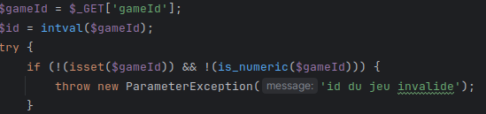
- Récupère l'ID du jeu envoyé via la requête GET.

- Convertit l'ID en entier avec intval().

- Valide si l'ID est bien défini et numérique.

- Lance une exception ParameterException si l'ID est invalide

#### Recherche du Jeu en Base de Données

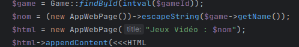

- Cherche le jeu correspondant avec Game::findById().

- Évite les failles XSS en nettoyant le nom avec escapeString().

- Crée une page web personnalisée avec le nom du jeu.

#### Création du Menu

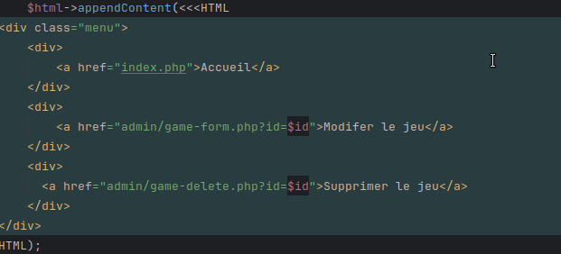

Affiche trois options :

- Retour à l'accueil.

- Modifier le jeu via game-form.php.

- Supprimer le jeu via game-delete.php.

#### Informations du Jeu

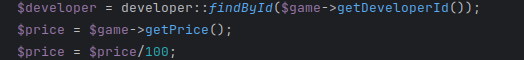

- Cherche le développeur associé au jeu.

- Convertit le prix (stocké en centimes) en euros.

#### Affichage des Systèmes d'Exploitation

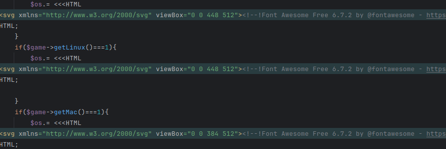

- Vérifie si le jeu est compatible avec Windows, Linux ou Mac.

- Affiche des icônes correspondantes

#### Détails du Jeu

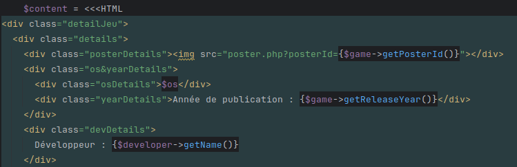

Affiche:

- Affiche du jeu (poster.php).

- Année de publication.

- Développeur.

- Systèmes compatibles.

#### Note Metacritic et Prix

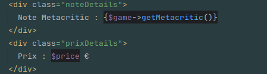

- Affiche la note Metacritic.

- Affiche le prix du jeu.

#### Ajout des Genres et Catégories

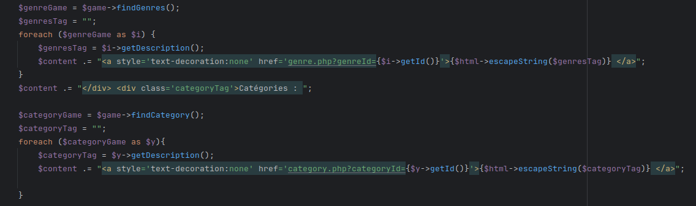

- Ajoute les liens vers les genres et catégories du jeu

#### Gestion des Erreurs

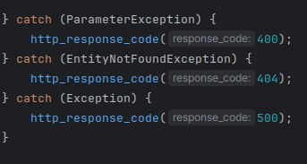

Gère les erreurs courantes :

- 400 Bad Request → ID invalide.

- 404 Not Found → Catégorie ou jeu introuvable.

- 500 Internal Server Error → Erreur inattendue.

### Classe Genre


#### Récupération et Validation de l'ID du Genre
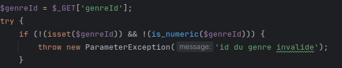

- Récupère l'ID du genre via la requête GET.

- Vérifie si l'ID est défini et bien un nombre (is_numeric()).

- Lance une exception ParameterException si l'ID est invalide.

#### Recherche du Genre en Base de Données

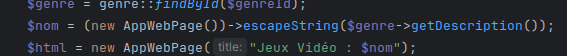

- Cherche le genre en base de données via genre::findById().

- Nettoie la description pour éviter les injections XSS (escapeString()).

- Crée une page web avec le nom du genre.

#### Création du Menu

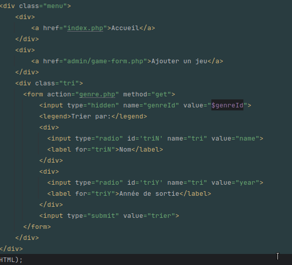
Ajoute un menu de navigation :

- Accueil.

- Ajout de jeu.

- Formulaire de tri des jeux par nom ou année de sortie

#### Affichage des Jeux du Genre

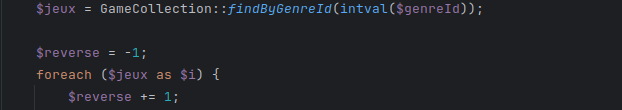
- Récupère tous les jeux associés au genre avec GameCollection::findByGenreId()

#### Alternance dans l'Affichage des Jeux

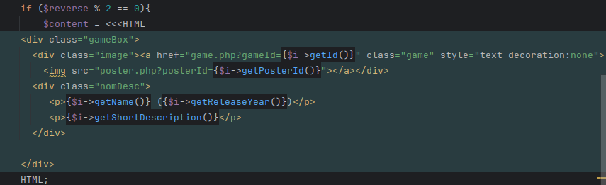
- Alterne l'affichage (gameBox et gameBox_rev) pour améliorer la mise en page.
Affiche :
- Image du jeu (poster.php).

- Nom et année de sortie.

- Description courte.


#### Gestion des Erreurs

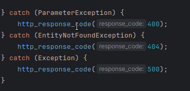
- 400 → ID de genre invalide.

- 404 → Genre ou jeux non trouvés.

- 500 → Erreur serveur.

### Classe poster

#### Récupération et Validation de l'ID du Poster

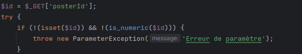

- Récupère l'ID du poster via la requête GET.

- Vérifie si l'ID est bien défini et numérique (is_numeric()).

- Lance une exception ParameterException si l'ID est invalide.

#### Recherche du Poster
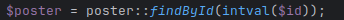

- Cherche le poster en base de données avec poster::findById()

#### Configuration du Type de Réponse
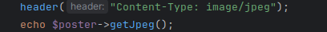

- Définit le type de réponse HTTP en image/jpeg.

- Affiche l'image en récupérant son contenu avec getJpeg()


#### Gestion des Erreurs
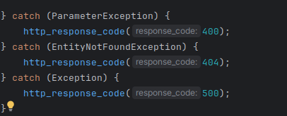

- 400 → Mauvaise requête (ID invalide).

- 404 → Poster introuvable.

- 500 → Erreur serveur.

### Classe index

#### Création de la Page HTML
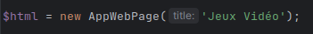
Crée une page HTML avec un titre "Jeux Vidéo"
#### Ajout du Menu
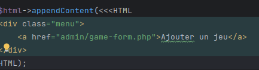
- Affiche un menu avec un lien permettant d'ajouter un jeu.
#### Affichage des Genres
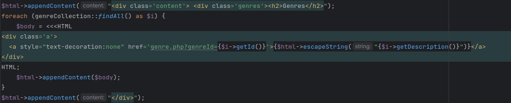
- Récupère tous les genres avec genreCollection::findAll().


- Affiche chaque genre sous forme de lien pointant vers genre.php?genreId=<ID>.
#### Affichage des Catégories
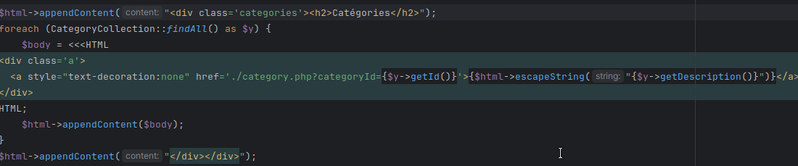
- Récupère toutes les catégories via CategoryCollection::findAll().

- Affiche chaque catégorie sous forme de lien pointant vers category.php?categoryId=<ID>.
#### Affichage Final
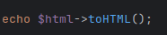
- Génère et affiche la page HTML complète

## Ajout des Exeptions

### Classe EntityNotFoundException

- Hérite de : \OutOfBoundsException
- levée lorsqu’une méthode de recherche (findById, etc.) ne trouve aucun résultat correspondant à l’identifiant fourni.

### Classe ParameterException

- Hérite de : \Exception
- levée lorsqu’un paramètre requis (comme un identifiant dans l’URL) est absent ou incorrect.

## Ajout du trait StringEscaper

### Methode

stringEscaper(?string $string = null): string
- Échappe les caractères spéciaux HTML dans une chaîne.

Utilise les options :
- ENT_QUOTES : échappe les guillemets simples et doubles.
- ENT_SUBSTITUTE : remplace les caractères invalides par un caractère de substitution.
- ENT_HTML5 : utilise les entités HTML5.

Retourne une chaîne sécurisée pour l'affichage HTML.

stripTagsAndTrim(?string $string): string
- Supprime toutes les balises HTML de la chaîne.
- Supprime les espaces en début et fin de chaîne.
- Retourne une chaîne vide si l’entrée est null.

## Methodes MyPdo

static getInstance(): self
- Retourne l’instance unique de MyPdo. Si elle n’existe pas encore, elle est créée à partir de la configuration disponible.

static setConfiguration(string $dsn, string $username = '', string $password = '', array $options = []): void
- Configure manuellement la connexion à la base de données.

private static hasConfiguration(): bool
- Vérifie si une configuration a été définie.

private static setConfigurationFromEnvironmentVariables(): bool
Tente de configurer la connexion à partir des variables d’environnement :

- MYPDO_DSN
- MYPDO_USERNAME
- MYPDO_PASSWORD

private static setConfigurationFromIniFile(): bool
- Tente de configurer la connexion à partir d’un fichier .ini :
.mypdo.ini

private function __construct(...)

- Constructeur privé pour empêcher l’instanciation directe. Active les clés étrangères si SQLite est utilisé.

private function __clone()

- Empêche le clonage de l’instance .


